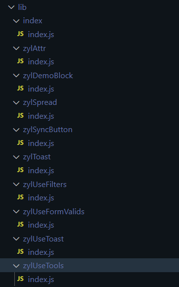
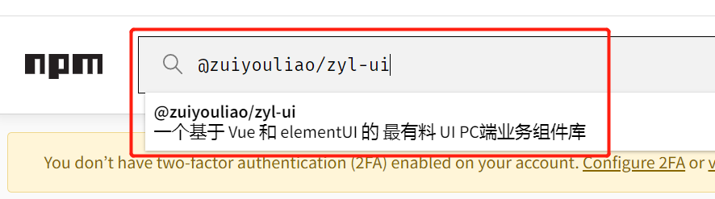

# 介绍

先分享两个有趣视频

<video width="320" height="240" controls>
  <source src="./img/icu.mp4" type="video/mp4">
</video>

<video width="320" height="240" controls>
  <source src="./img/product.mp4" type="video/mp4">
</video>

### 初衷

我们经常会发现很多项目内封装的组件和工具类**风格和交互逻辑是一样的**。此前的做法是从一个项目 copy 到另一个项目去使用，或者接手的项目的人不知道项目有封装过类似的组件自己又封装了一个。就造成了每个项目是独立的，维护比较困难，UI 交互和风格方面也不能统一。

**基于这个痛点，我们可以把这些通用型业务组件和工具类从每个项目里抽离出来，发布成一个 npm 包统一进行管理下载和版本迭代，并且提供文档说明，对于接手项目的人来说会比较友好，也能减少重复造轮子和开发工作量，UI 交互和风格方面较容易达成统一。**

最后，欢迎大家一起来完善和共享这个业务组件库，让它后续更方便为开发提效所用。

### 组件库特点

业务组件基于成熟的 UI 组件库进行二次封装 [ElementUI](http:#element-cn.eleme.io/#/zh-CN)

### 聊一聊组件库基本原理和架构

搭建一个基本组件库流程主要有以下几个过程（**当然一个成熟的组件库还为开发体验和优化做了很多边缘适配和拓展，如单元测试、自动化生成构建、为组件设置命名空间等等，这里就不进行一一介绍，我们先实现一个最基础的版本**）：

- 1、编写组件库的架手架环境搭建（这里采用 vue-cli）
- 2、组件库的内容编写（这里采用 vue2 语法）
- 3、组件库的入口文件暴露（利用 Vue.use 的 install 方法）
- 4、组件库的入口打包配置处理（这里采用 webpack，rollup 会更适合）
- 5、组件库文档搭建（这里采用 vuepress）
- 6、组件库打包发布 npm

#### vue-cli 初始化项目

```bash
vue create zyl-ui
```

#### 目录结构及配置

```bash
config
│  └─config.build.js # 生产环境的webpack配置
│  └─config.dev.js # 开发环境的webpack配置
│
doc 组件库文档 # 文档配置可参考 [vuepress官方文档](https://v1.vuepress.vuejs.org/zh/)
│
examples # 实时调试组件展示效果使用
│  └─App.vue #主入口页面
│  └─main.js #主入口js引入
│
lib # 打包后的产物
│
packages # 需要打包的内容
│  │
│  └─ components # 组件
│  │      │
│  │      └─zylSyncButton
│  │      │ └─src
│  │      │ │ └─index.vue # 组件内容
│  │      │ └─index.js # 单组件暴露入口
│  │      │
│  │      └─zylToast # 组件
│  │      │ └─src
│  │      │ │  └─index.vue # 组件内容
│  │      │ └─index.js # 单组件暴露入口
│  │      └─...
│  │
│  └─ plugins # 插件
│  │      │
│  │      └─zylUseFormValids
│  │      │ │
│  │      │ └─index.js # 单组件暴露入口
│  │      │
│  │      └─zylUseFilters # 组件
│  │      │ │
│  │      │ └─index.js # 单组件暴露入口
│  │      │
│  │      └─zylUseTools # 组件
│  │      │ │
│  │      │ └─index.js # 单组件暴露入口
│  │      └─...
│  └─ index.js # 总暴露入口
│
.public # 存放一些静态文件
.eslintignore # eslint需要忽略校验的文件或目录
.gitignore # git提交需要忽略校验的文件或目录
.npmrc # 设置 package.json 中依赖包的安装来源
babel.config.js # babel转译的配置文件
jsconfig.json # 优化ide开发体验，比如文件内地址关联跳转等
package.json # 依赖包、脚本指令等重要信息
yarn.lock # yarn 锁定包版本
README.md  # 项目说明文档
vue.config.js  #vue-cli和webpack打包相关配置项
```

#### 组件库单个文件入口暴露（用于按需引入）

`src/packages/components/zylSyncButton/index.js`

```js
// src/packages/components/zylSyncButton/index.js

import zylSyncButton from './src/index.vue'

zylSyncButton.install = function (Vue) {
  Vue.component(zylSyncButton.name, zylSyncButton)
}

export default zylSyncButton
```

#### 组件库总入口暴露

`src/packages/index.js`

```javascript
// src/packages/index.js

// 引入插件
import zylUseToast from './plugins/zylUseToast'
import zylUseFormValids from './plugins/zylUseFormValids'
const plugins = [zylUseToast, zylUseFormValids]

// 引入组件
import zylAttr from './components/zylAttr'
import zylDemoBlock from './components/zylDemoBlock'
const components = [zylAttr, zylDemoBlock]

// 定义 install 方法，接收 Vue 作为参数。如果使用 use 注册插件，则所有的组件都将被注册
const install = (Vue) => {
  // 判断是否安装
  if (install.installed) return
  // 批量注册全局插件
  plugins.map((plugin) => {
    Vue.use(plugin)
  })
  // 批量注册全局组件
  components.map((component) => {
    Vue.component(component.name, component)
  })
}

// 判断是否是直接引入文件,有可能组件会通过script标签引入，如<script src='https://xxx/zyl-ui'></script>
if (typeof window !== 'undefined' && window.Vue) {
  install(window.Vue)
}

// 暴露安装方法，用于全量引入,导出的对象必须具有 install，才能被 Vue.use() 方法安装
export default install
// 暴露安装方法，用于按需引入
export { install, zylUseToast, zylUseFormValids, zylAttr, zylDemoBlock }
```

以插件的方式使用组件：

`examples/main.js`

```javascript
// examples/main.js

import Vue from 'vue'
import ElementUI from 'element-ui' // 全局引入
import 'element-ui/lib/theme-chalk/index.css'

// 引入zylUI组件
import zylUI from '@packages'
// 注册组件库
Vue.use(zylUI)
```

@packages 为 `config/config.dev.js` 别名配置

```js
// config/config.dev.js

// 扩展 webpack 配置
chainWebpack: (config) => {
  config.resolve.alias.set('@', '/examples').set('@packages', '/packages')
}
```

#### 组件库的入口打包配置处理

`vue.config.js` 不同环境选择不通编译配置

```js
// vue.config.js

// 开发环境（编译构建的是examples文件夹内的东西，用于组件库开发调试）
const devConfig = require('./config/config.dev')

// 打包环境（编译构建的是packages文件夹内的东西，用于打包组件发布npm）
const buildConfig = require('./config/config.build')

// 根据运行环境选择编译配置
module.exports = process.env.NODE_ENV === 'production' ? buildConfig : devConfig
```

`config/config.build.js` 生产环境编译 packages 文件夹下内容（配置从哪里打包到哪里）

```js
// config/config.build.js

const fs = require('fs')
const path = require('path')
const join = path.join
//  获取基于当前路径的目标文件
const resolve = (dir) => path.join(__dirname, '../', dir)

// 获取组件库的每个包的入口文件地址
function getComponentEntries(path) {
  let files = fs.readdirSync(resolve(path))

  const componentEntries = files.reduce((fileObj, item) => {
    //  文件路径
    const itemPath = join(path, item)
    //  在文件夹中
    const isDir = fs.statSync(itemPath).isDirectory()
    const [name, suffix] = item.split('.')

    // 文件中的入口文件
    if (isDir) {
      fileObj[item] = resolve(join(itemPath, 'index.js'))
    }
    //  文件夹外的入口文件
    else if (suffix === 'js') {
      fileObj[name] = resolve(`${itemPath}`)
    }
    return fileObj
  }, {})

  return componentEntries
}

const buildConfig = {
  //  输出文件目录
  outputDir: resolve('lib'),
  productionSourceMap: false,
  //  webpack配置
  configureWebpack: {
    //  入口文件(这里获取到的是每个独立包的入口文件地址数组)
    entry: {
      // 全量引入的文件入口
      index: resolve('packages'),
      // 按需引入的文件入口
      ...getComponentEntries('packages/plugins'),
      ...getComponentEntries('packages/components'),
    },
    //  输出配置
    output: {
      //  主入口文件名称
      filename: '[name]/index.js',
      //  构建依赖类型
      libraryTarget: 'umd',
      //  库中被导出的项
      libraryExport: 'default',
      //  引用时的依赖名
      library: 'zyl-ui',
    },
  },
  css: {
    sourceMap: false,
    // 是否将组件中的css提取至一个独立的css，库构建时可以设置为false，免得用户需要自己导入css
    extract: false,
    // extract: {
    //   filename: '[name]/index.css',
    // },
  },
  chainWebpack: (config) => {
    // 一些构建优化
    config.optimization.delete('splitChunks')
    config.plugins.delete('copy')
    config.plugins.delete('preload')
    config.plugins.delete('prefetch')
    config.plugins.delete('html')
    config.plugins.delete('hmr')
    config.entryPoints.delete('app')
  },
}

module.exports = buildConfig
```

`package.json` 执行编译指令 `npm run build vue-cli-service` 内部读取 `vue.config.js` --> `config/config.build.js` 进行编译打包为 `UMD规范` 在 `lib` 文件夹下

```js
// package.json

"scripts": {
  "serve": "vue-cli-service serve",
  "build": "vue-cli-service build",
},
```



- 配置运行入口和包信息

`package.json`

```json
// package.json

{
  "name": "@zuiyouliao/zyl-ui", //包名
  "version": "0.1.0", //版本号
  "private": false, //是否私有化部署
  "author": "zly <294333196@qq.com>", //作者
  "license": "MIT", //开源协议
  "description": "一个基于 Vue 和 elementUI 的 最有料 UI PC端业务组件库", //项目描述
  // 上传npm主页的一些关键文件识别
  "directories": {
    "doc": "docs",
    "example": "examples",
    "lib": "lib"
  },
  // 上传npm的文件白名单（哪些需要上传）
  "files": ["packages", "lib", "docs"],
  // 引用包的主入口地址
  "main": "lib/index"
}
```

- 将项目 link 到全局下做一个快捷方式映射让本地的包就好像 install 过一样，可以直接使用。

在 zyl-ui 项目根目录下执行

```bash
npm link
```

然后就可以在`examples/main.js` 愉快的使用打包结果

```js
// examples/main.js

import Vue from 'vue'
import ElementUI from 'element-ui' // 全局引入
import 'element-ui/lib/theme-chalk/index.css'
Vue.use(ElementUI)

// 引入zylUI组件
import zylUI from '@zuiyouliao/zyl-ui'
// 注册组件库
Vue.use(zylUI)
```

::: tip
`npm link` 操作会在项目的 node_modules 目录下创建一个 module1 的超链接（类似 Windows 的快捷方式），链接到 project_npmlink/module1。

生成的虚拟包名会根据 module1 的 package.json 进行指定。
:::

#### 组件库文档搭建

VuePress 是 Vue 驱动的静态网站生成器。支持在 Markdown 中使用 Vue 组件，简洁，高性能。当然你也可以使用其他的文档生成器，如 Docz、Storybook 等。

文档安装和配置可参考 [vuepress 官方文档](https://v1.vuepress.vuejs.org/zh/)

`package.json` 安装完可在项目根目录配置启动和构建脚本

```json
// package.json

{
  "doc:dev": "vuepress dev doc",
  "doc:build": "vuepress build doc"
}
```

`.vuepress/enhanceApp.js` 相当于 mian.js 为项目入口，可在此安装插件

```javascript
// vuepress/enhanceApp.js

import Vue from 'vue'
import ElementUI from 'element-ui' // 全局引入
import 'element-ui/lib/theme-chalk/index.css'

// 引入未编译的代码可以边写文档边调试
import zylUI from '../../packages'

// 也可以引入zylUI组件打包产物 前提要 npm link
// import zylUI from '@zuiyouliao/zyl-ui'

export default ({ Vue }) => {
  Vue.use(ElementUI)
  Vue.use(zylUI)
}
```

#### 发布组件到 npm

发布前，需要确保 `package.json` 中这些字段。

1. name

它是发布到 npm 上的包名，也是安装时的包名。请保证它的唯一性，可以到 npm 上先搜索一下，是否已经存在。

2. version

版本号，遵守语义化版本规则。每次新发布都要进行更改。可以使用 `npm version [major.minor.patch]` 命令来执行更新。

3. main

是包的入口。

```bash
npm addUser # 如果没有用户名就注册一个，否则直接登录
npm login # 登录，输入密码
npm publish # 发布，zyl-ui根目录下执行
```

等过一会儿，就可以到 [npm](https://www.npmjs.com/) 上搜索到发布的包 [@zuiyouliao/zyl-ui](https://www.npmjs.com/package/@zuiyouliao/zyl-ui) 。这里我创建了一个`zuiyouliao`组织可以使用组织的命名空间`@zuiyouliao/zyl-ui`，其他协作者只需要被邀请加入组织就可以发布 这个 npm 组件包了



接下来你就可以 `npm install @zuiyouliao/zyl-ui` 安装并使用你自己的组件库了。
